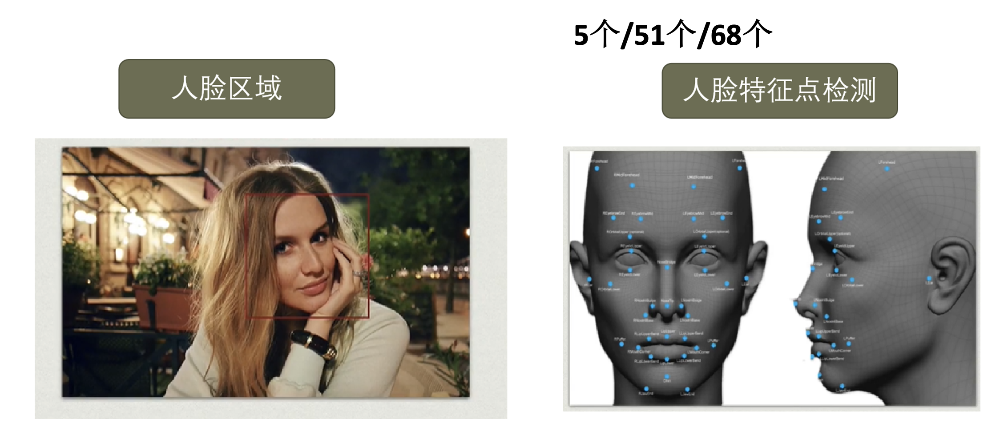
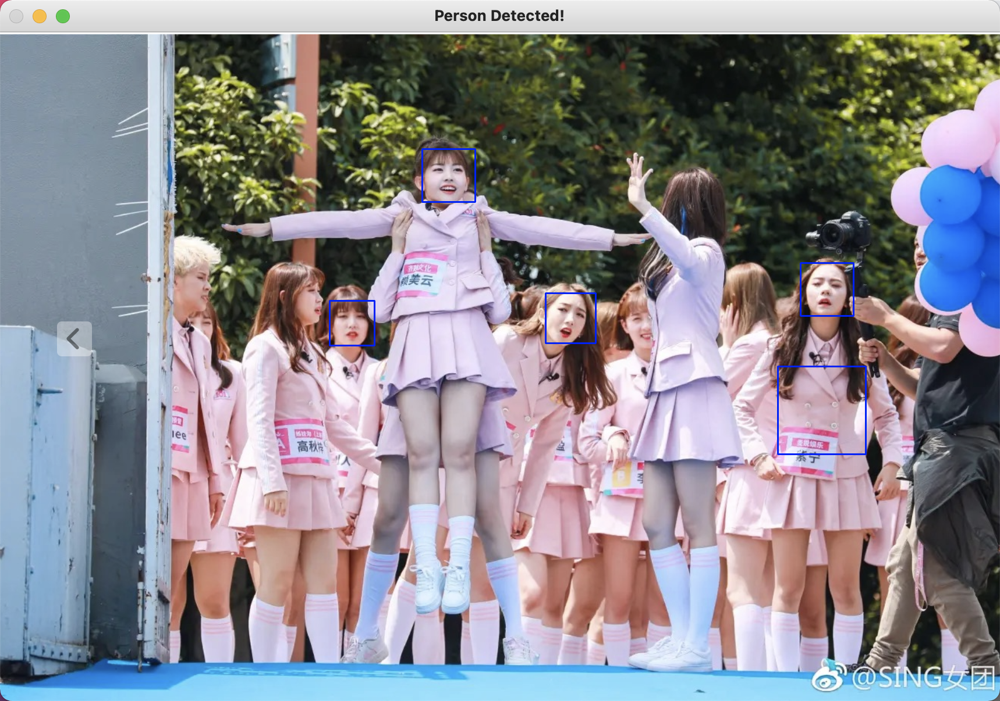
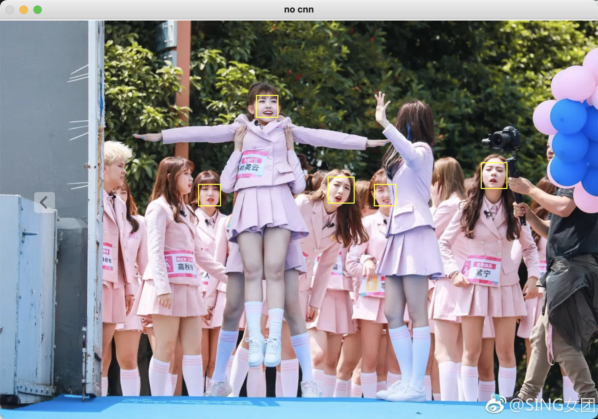

# 人脸识别的入门学习

> 此项目用于人脸识别的入门级学习，仅供参考

[TOC]
## 简介

人脸识别，是基于人的脸部特征信息进行身份识别的一种生物识别技术。用摄像机或摄像头采集含有人脸的图像或视频流，并自动在图像中检测和跟踪人脸，进而对检测到的人脸进行脸部识别的一系列相关技术，通常也叫做人像识别、面部识别。

如今，人脸识别的应用随处可见：支付，打卡，解锁等等。。。其算法也成为了热门的研究内容，如果算法不佳或数据库差劲，很有可能导致人脸无法识别甚至识别出“世界上另一个你”的名字（明示北京某传媒大学校门）。

那么接下来就让我们初探人脸识别吧。

人脸识别系统主要有四个步骤

```flow
st=>start: 人脸识别系统
op1=>operation: 人脸检测
op2=>operation: 人脸对齐
op3=>operation: 提取人脸特征向量
op4=>operation: 人脸匹配

st->op1->op2->op3->op4
```

## 人脸检测



### 仅opencv
- **安装opencv-python**

``` bash
pip install opencv-python
```

在macos系统中，需要将**haarcascade_frontalface_default.xml**的路径找到并写入代码中。

一般路径："/Library/Frameworks/Python.framework/Versions/3.7/lib/python3.7/site-packages/cv2/data/haarcascade_frontalface_default.xml"

- **code-demo**
``` python
import cv2

def detect(filename):
    face_cascade = cv2.CascadeClassifier('/Library/Frameworks/Python.framework/Versions/3.7/lib/python3.7/site-packages/cv2/data/haarcascade_frontalface_default.xml')
    #加载haar数据
    img=cv2.imread(filename)
    #加载图片,读进来直接是BGR格式
    gray=cv2.cvtColor(img,cv2.COLOR_BGR2GRAY)
    #cv2.cvtColor(p1,p2) 是颜色空间转换函数，p1是需要转换的图片，p2是转换成何种格式。
    #cv2.COLOR_BGR2GRAY 将BGR格式转换成灰度图
    faces = face_cascade.detectMultiScale(gray, 1.3, 5)
    # 识别图像中的人脸，返回所有人脸的矩形框向量组
    # scaleFactor=1.3 为了检测到不同大小的目标，通过scalefactor参数把图像长宽同时按照一定比例1.3逐步缩小，
    # 然后检测，这个参数设置的越大，计算速度越快，但可能会错过了某个大小的人脸。
    # minNeighbors=5 构成检测目标的相邻矩形的最小个数，此处设置为5

    for(x,y,w,h) in faces:
        img=cv2.rectangle(img,(x,y),(x+w,y+h),(255,0,0),2)
    
    #在图像中画上矩形框
    cv2.imshow('Person Detected!',img)
    cv2.waitKey(0)
    cv2.destroyAllWindows()
    #显示结果

if __name__ == '__main__':
    detect('image/101.png')
```

- **识别结果**

可以看到，虽然有一些人脸能够被正确识别到，但还是有一些人脸（例如侧脸）不能够识别，甚至有一些错误的识别。这就要求我们使用更高级的算法来识别人脸

### face_recognition
> GitHub项目：face_recognition
    - 该项目目前star数超过3万，是GitHub上最主流的人脸识别工具包之一。
    - Face_recognition主要参考了OpenFace项目以及谷歌的facenet。
    - 世界上最简洁的人脸识别库，可以使用Python和命令行工具提取、识别、操作人脸。
    - 本项目的人脸识别是基于业内领先的C++开源库dlib中的深度学习模型，用Labeled Faces in the Wild人脸数据集进行测试，有高达99.38%的准确率。但对小孩和亚洲人脸的识别准确率尚待提升。
- **安装dlib和face_recognition**

在安装dlib时，可能会因为没有安装依赖包而出现错误，所以在安装dlib之前，我们先用brew安装openblas和cmake

``` bash
brew install openblas

brew install cmake

pip install dlib

pip install face_recognition
```

- **code-demo**
``` python
import face_recognition
import cv2

def detect(filename):
    image=face_recognition.load_image_file(filename)
    #加载图片到image
    face_locations_noCNN=face_recognition.face_locations(image)
    #Returns an array of bounding boxes of human faces in a image
    #A list of tuples of found face locations in css (top, right, bottom, left) order
    #因为返回值的顺序是这样子的，因此在后面的for循环里面赋值要注意按这个顺序来

    print("face_location_noCNN:")
    print(face_locations_noCNN)
    face_num2=len(face_locations_noCNN)
    print("I found {} face(s) in this photograph.".format(face_num2))
    # 到这里为止，可以观察两种情况的坐标和人脸数，一般来说，坐标会不一样，但是检测出来的人脸数应该是一样的
    # 也就是说face_num1　＝　face_num２；　face_locations_useCNN　和　face_locations_noCNN　不一样

    org=cv2.imread(filename)
    img=cv2.imread(filename)
    #cv2.imshow(filename,img) #显示原始图片

    for i in range(0,face_num2):
        top=face_locations_noCNN[i][0]
        right=face_locations_noCNN[i][1]
        bottom=face_locations_noCNN[i][2]
        left=face_locations_noCNN[i][3]

        start=(left,top)
        end=(right,bottom)

        color=(0,255,255)
        thickness=2
        cv2.rectangle(org,start,end,color,thickness)
        #cv2.rectangle(img, pt1, pt2, color[, thickness[, lineType[, shift]]]) → None
        #img:图片   pt1&pt2:矩形的左上角和右下角    color:矩形边框的颜色(rgb)   thickness:参数表示矩形边框的厚度

    cv2.imshow("no cnn",org)
    cv2.waitKey(0)
    cv2.destroyAllWindows()

    # # use CNN
# face_locations_useCNN = face_recognition.face_locations(image,model='cnn')
# model – Which face detection model to use. “hog” is less accurate but faster on CPUs.
# “cnn” is a more accurate deep-learning model which is GPU/CUDA accelerated (if available). The default is “hog”.

# print("face_location_useCNN:")
# print(face_locations_useCNN)
# face_num1=len(face_locations_useCNN)
# print(face_num1)       # The number of faces


# for i in range(0,face_num1):
#     top = face_locations_useCNN[i][0]
#     right = face_locations_useCNN[i][1]
#     bottom = face_locations_useCNN[i][2]
#     left = face_locations_useCNN[i][3]
#
#     start = (left, top)
#     end = (right, bottom)
#
#     color = (0,255,255)
#     thickness = 2
#     cv2.rectangle(img, start, end, color, thickness)    # opencv 里面画矩形的函数

# # Show the result
# cv2.imshow("useCNN",img)

if __name__ =='__main__':
    detect('image/101.png')
```

- **识别结果**


可以看到，相比较第一次识别的结果，这一次的准确度提高了，但是在这次识别中，侧脸依旧无法识别，所以我们要找到人脸特征点。

### 人脸特征点
Dlib有专门的函数和模型，能够实现人脸68个特征点的定位。
找到特征点后，就可以通过图像的几何变换（仿射、旋转、缩放），使各个特征点对齐（将眼睛、嘴等部位移到相同位置）。

- **下载包**
需要下载包：[shape_predictor_68_face_landmarks.dat]("shape_predictor_68_face_landmarks.dat")
并添加到路径"/Library/Frameworks/Python.framework/Versions/3.7/lib/python3.7/site-packages"中（mac用户）
- **code-demo**
``` python
#coding=utf-8

import cv2
import dlib

def detect(filename):
    img=cv2.imread(filename)
    gray=cv2.cvtColor(img,cv2.COLOR_BGR2GRAY)

    #人脸分类器
    detector=dlib.get_frontal_face_detector()
    #获取人脸检测器
    predictor=dlib.shape_predictor(r"/Library/Frameworks/Python.framework/Versions/3.7/lib/python3.7/site-packages/shape_predictor_68_face_landmarks.dat")
    #dets保存的是图像中人脸的矩形框，可以有多个
    dets=detector(gray,1)
    
    for face in dets:
        shape=predictor(img,face)# 寻找人脸的68个标定点
        # 遍历所有点，打印出其坐标，并圈出来
        for pt in shape.parts():
            pt_pos=(pt.x,pt.y)
            cv2.circle(img,pt_pos,2,(0,255,0),1)
        cv2.imshow("image",img)

    cv2.waitKey(0)
    cv2.destroyAllWindows()

if __name__=='__main__':
    detect('image/101.png')
```
- **识别结果**


虽然这次依旧没有能够把侧脸识别出，这说明了我们的算法依然待提升，但是成功将几个人脸的特征点提取出来了，这也为我们之后对人脸进行对齐等操作提供了数据。

不如来欣赏一下其他特征点结果吧：


## 人脸对齐

## 提取人脸的特征向量

## 人脸匹配


## 参考资料
cv2.rectangle 参数含义：https://blog.csdn.net/Gaowang_1/article/details/103087922?ops_request_misc=%257B%2522request%255Fid%2522%253A%2522162114388816780264037797%2522%252C%2522scm%2522%253A%252220140713.130102334..%2522%257D&request_id=162114388816780264037797&biz_id=0&utm_medium=distribute.pc_search_result.none-task-blog-2~all~top_positive~default-1-103087922.first_rank_v2_pc_rank_v29&utm_term=cv2.rectangle
detectmultiscale函数参数含义：https://blog.csdn.net/weixin_39900531/article/details/111514957?ops_request_misc=%257B%2522request%255Fid%2522%253A%2522162114885516780366566806%2522%252C%2522scm%2522%253A%252220140713.130102334.pc%255Fall.%2522%257D&request_id=162114885516780366566806&biz_id=0&utm_medium=distribute.pc_search_result.none-task-blog-2~all~first_rank_v2~rank_v29-1-111514957.first_rank_v2_pc_rank_v29&utm_term=face_cascaded.detectMultiScale